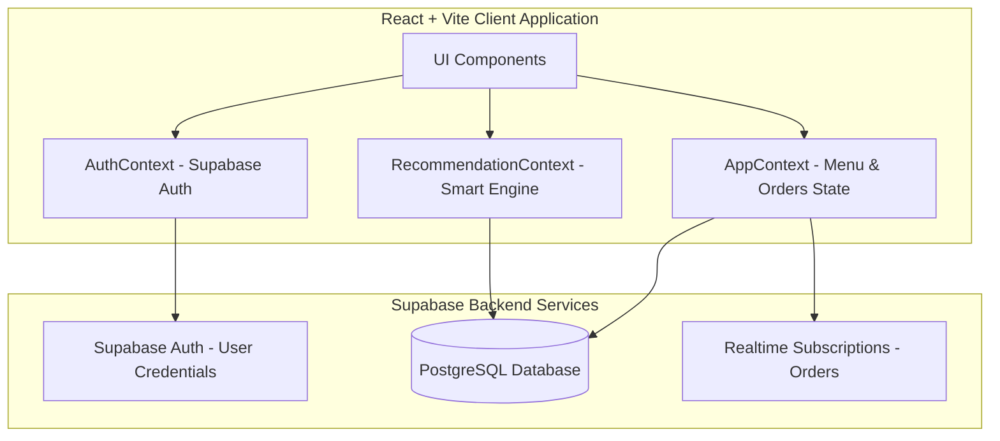

# 🍔 UniFood - Smart Canteen Management System

UniFood is a premium, modern, and highly interactive Canteen Management System designed to streamline food ordering, menu browsing, and order tracking on college campuses. Integrating role-based access control, smart recommendations, allergy alerts, and real-time database updates, UniFood offers a seamless experience for both **Students** and **Canteen Managers**.

---

## 🌟 Key Features

### 🎓 For Students
- **Smart Menu Browser:** Sort, filter, and search by category, cuisine, veg/non-veg, spice level, price, and customer ratings.
- **Dietary & Allergen Profile:** Set personal dietary restrictions (Vegetarian, Vegan, Gluten-Free) and allergens (Dairy, Gluten, Eggs, Soy, Nuts).
- **Intelligent Recommendations:**
  - *Profile Recommendations:* Automatic suggestions matching the user's dietary profile, falling back to top-rated items or past order history.
  - *Cross-Item Cart Recommendations:* Suggests items commonly ordered together by other customers when items are added to the cart.
  - *Allergen Alerts:* Proactively warns students if they attempt to add an item containing their configured allergens.
- **Simulated Checkout & Payments:** Add special instructions, schedule a custom pickup time, and pay via simulated Card, UPI, Wallet, or Net Banking options.
- **Real-Time Order Tracking:** Watch the live order status progress through `Ordered` ➔ `Preparing` ➔ `Ready` ➔ `Served`.
- **One-Click Reorder:** Instantly load items from past orders back into the cart with a single click.

### 💼 For Canteen Managers
- **Analytics Dashboard:** Visual representation of key metrics, including live revenue, total orders, popular dishes, average order value, and peak transaction hours.
- **Live Order Management:** Track and process orders in real time. Easily transition order status to alert students immediately.
- **Menu & Inventory Management:** Add, edit, or delete items. Toggle availability, adjust stock quantities, and update price and allergen tags on the fly.

### 🔒 Core Platform Features
- **Supabase Authentication:** Secure signup/signin flow.
- **OTP Verification:** Email-based OTP checks during registration (restricted to `@iiitkottayam.ac.in` domain by default).
- **Real-time Notifications:** Instant toast popups and menu alerts driven by Supabase real-time subscriptions.
- **Row Level Security (RLS):** Bulletproof database security, ensuring students can only view or modify their own orders and profile data.

---

## 🏗️ Architecture & Technology Stack

### Frontend
- **Framework:** React 18 & Vite
- **Language:** TypeScript
- **Styling:** Tailwind CSS (utility-first, responsive grid, glassmorphism transitions)
- **Routing:** React Router DOM (v7)
- **Icons:** Lucide React
- **Notifications:** React Hot Toast

### Backend & Database
- **Backend-as-a-Service:** Supabase
- **Database:** PostgreSQL (with triggers, check constraints, and performance indexes)
- **Realtime Services:** PostgreSQL replication via Supabase Realtime client

### Testing
- **Suite:** Jest & Babel
- **Helper:** Testing Library (React/DOM) & ts-jest



---

## 📂 Project Structure

```text
unifood_demo/
├── .env                         # Local environment configuration variables
├── babel.config.js              # Babel test environment compiler options
├── eslint.config.js             # ESLint style guidelines configuration
├── index.html                   # Entry HTML markup
├── jest.config.cjs              # Test runner configuration file
├── package.json                 # Node project scripts and dependencies
├── postcss.config.js            # PostCSS plugin configurations
├── tailwind.config.js           # Tailwind utility prefixing settings
├── tsconfig.json                # TypeScript global options
├── src/
│   ├── App.tsx                  # Root Routing setup and context wrapping
│   ├── index.css                # Base Tailwind styling imports
│   ├── main.tsx                 # Client bootstrap entrypoint
│   ├── setupTests.ts            # Testing environment mock configurations
│   ├── __tests__/               # Test suites for components and contexts
│   ├── components/
│   │   ├── auth/                # Login, Register, OTP, Reset Password UI
│   │   ├── common/              # Header, Bottom Navigation, Settings UI
│   │   ├── manager/             # Dashboards, Live orders, Inventory, Stats
│   │   └── student/             # Dashboard, Menu browsing, Cart, Live Tracker
│   ├── contexts/
│   │   ├── AppContext.tsx       # Live global app data loader (from database)
│   │   ├── AuthContext.tsx      # Handles Auth profiles and token session
│   │   └── RecommendationContext.tsx # Allergen and smart recommendations logic
│   ├── lib/
│   │   ├── email.ts             # Direct OTP email sender service mock
│   │   ├── passwordValidator.ts # Password pattern checks
│   │   ├── payments.ts          # Simulated transaction processing
│   │   └── supabase.ts          # Initialized Supabase client instance
│   └── types/
│       └── index.ts             # TypeScript entity definitions
└── supabase/
    └── migrations/              # SQL files for schema migration setup
```

---

## 🛠️ Setup & Installation

Follow these steps to set up and run UniFood on your local machine:

### 1. Prerequisites
Ensure you have the following installed:
- [Node.js](https://nodejs.org/) (v18 or higher recommended)
- [npm](https://www.npmjs.com/)
- A [Supabase](https://supabase.com/) account (to host your backend database)

### 2. Install Dependencies
Clone the repository and run:
```bash
npm install
```

### 3. Database Migration
1. Create a new project on the [Supabase Dashboard](https://supabase.com).
2. Navigate to the **SQL Editor** in your Supabase dashboard.
3. Copy the contents of the migration files inside the `supabase/migrations/` folder:
   - First, run the contents of [20250907104102_fragrant_tooth.sql](file:///supabase/migrations/20250907104102_fragrant_tooth.sql) to set up the initial tables, triggers, indexes, and Row Level Security (RLS) policies.
   - Second, run the contents of [20251031120000_unifood_updates.sql](file:///supabase/migrations/20251031120000_unifood_updates.sql) to update user preference structures and seed 50+ diverse food menu items.

### 4. Configuration
Create a `.env` file in the root directory and define the following variables:
```env
VITE_SUPABASE_URL=https://your-project-id.supabase.co
VITE_SUPABASE_ANON_KEY=your-supabase-anonymous-key
VITE_STRIPE_PUBLISHABLE_KEY=pk_test_your_stripe_publishable_key

# Optional for OTP-based email verification:
SMTP_HOST=smtp.gmail.com
SMTP_PORT=587
SMTP_USER=your-email@gmail.com
SMTP_PASS=your-app-password
```

### 5. Running the Application
To run the local development server:
```bash
npm run dev
```
Open [http://localhost:5173](http://localhost:5173) in your browser to view the application.

---

## 🧪 Testing

The codebase includes an suite of unit tests for authentication components, settings, dashboards, and application state contexts.

To execute tests run:
```bash
npm test
```

For test coverage reports, run:
```bash
npm run test:coverage
```

---

## 🗄️ Database Schema Details

### Tables
1. **`users`**: Profiles for students and managers, storing preferences like `allergens` and `dietary_preferences`.
2. **`menu_items`**: Full canteen catalog with price, category, veg/non-veg type, ingredients, average ratings, preparation time, and allergen array.
3. **`orders`**: Active and past transactions tracking status, pickup times, customized instructions, and token/payment details.
4. **`reviews`**: Customer ratings and comments connected to menu items.
5. **`notifications`**: Live notifications sent to users when their order statuses change.
6. **`otp_verifications`**: OTP codes for registration verification.

---

## 🛡️ Security & Row Level Security (RLS)
- **RLS Enabled:** RLS is active on all main tables (`users`, `menu_items`, `orders`, `reviews`, `notifications`, `otp_verifications`).
  - **Profile Security:** Students can only read and update their own user profile matching `auth.uid()`.
  - **Order Privacy:** Students can only query/create their own orders. Managers have full access to select/update order statuses for campus operations.
  - **Menu Management:** Anyone authenticated can select items. Modification permission (INSERT, UPDATE, DELETE) is restricted to accounts with the role `'manager'`.
